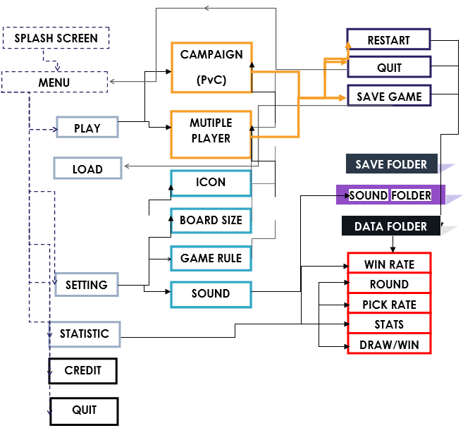

# Gomoku
GOMOKU game is based on a simple game named Caro/ Gomoku.The program is programed by C++ language.

## Student Infomation

- Student Name: Ha Duc Minh Thao
- Student Id  : 18125139
- Project     : GOMOKU (Individual)

## About Project
This is my first game project in CS161, the program is included a lot of my skills and knowledge about programming.

## Project Structure

## Details

- Important class:
1. GameStateMainMenu
2. GameStateGame
3. Game
4. Board
5. Input
6. LayoutMainMenu
7. LayoutGame

- In this project we use "ncurses.h" library for UI/UX. This library build the main graphics of our game.

- In the part of splash screen and menu screen, we combine it together.
- In order to make an interesting Splash Screen, we make the animation for it. It just a O-X line fall down like a rain.
- This game is a loop. This loop look like that

- There are 2 main state
 ### State Main Menu
  Include main menu, slash screen, animation, titile, …
 1. Multiplayer (PvP) : This option will go to GameState for 2 person. We need choose the character for each person (just a name :D ) before play.
 2. Campaign (PvC) : Let's play with bot in this option. Again, we need choose the level to play this Bot. there are 4 level (maybe 3) to play. The "LOKI" bot, this bot is just check a move with open 4 or 3 to play when the opponent can't win with open 3 or 4. The "Red Skull" and "Loki" bot are use heuristic function to set point for the move. Which move with the "best" score will used to play. The "Thanos" bot is Hardest, It use Minimax algorithm with the heuristic function to get move. For the good Minimax ( maybe fast) it use alpha beta pruning and imit the depth to iterative
 3. Load: We can choose a game which is saved to play continue. I use the library "dirent.h" to open folder save game. And get the name which user saved. To remove a game, we use a hack to do that. Just use this command "rm filename".
 4. Setting: there are many option for user in setting. Size board (SMALL, MEDIUM, BIG), Icons (6 icon set), Background(6 background set too) and Rule (just 8 rule). With background we use another big hack.. I change the theme of terminal to change the background.
 5. Statictis: This is display rating, game played in both mode, game win in PvC mode.
 6. About us: This option is display credit and about screen.
 
 ### State Game
  This state will draw a board, and info for the game.
 1. Board: A board is render in center of screnn . And it get user interact like up, down, left , right , make a stone…
 2. The info game: It show a lot of info about this game: Size board, name, icon, game rule and short describe for this rule.
 3. The info player: It show :who turn, score, and it have a small animation win/lose.
 4. The help: It show the command shortcut which user can press to do something like: pause this game, resign (GGWP :v), turn On/Off music, Undo.
 
 ### State Show Game
  This is sate is just render the game which is complete game in history.
 
 ### Music And Sound Effect
 I use the library "SFML" to play sound effect and music in game.
 
 ### Game Rule
  Many rule are just the "b i ến thể" of gomoku game. In that, have a rule I make, It is a funny rule (let try it :D)
  
 ### Save Game
  In paused menu, I create a option for user can save and quit this game. The default name is generation is "GOMOKU_XX" with XX is the number of file saved in saved folder . User can change the name file.
  
 ### Rating
  User have a rating which start in 1500. I use the rating system like CodeForce (LOL :P ). The user will gain the rating when play with BOT.
  
## Data Structure

- We save data of the board by using a vector of vector int and we keep it in enum type.
- In order to save the game we use text to store data. (Store many data here)
- There is sometime we use Map data structure to store  score for our BOT.
